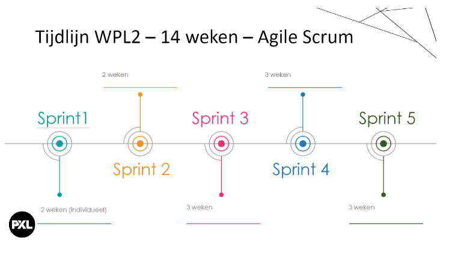

# Logboek werkplekleren
Werkplekleren is een belangrijk onderdeel in de studie van Graduaat Systemen en Netwerken.

Het doel van WPL1 was oriëntering en kennismaken met het werkveld.
Hiervoor hebben we opdrachten gedaan om het werkveld te verkenning, stilgestaan bij persoonlijke kwaliteiten en ontwikkeling, gastcolleges gevolgd en kleine technische opdrachten uitgevoerd.
## Logboek WPL 1

## Logboek WPL 2
zie Opdrachten en Relfectie

## Logboek WPL 3

[Bekijk Stage Logboek](https://drive.google.com/file/d/15-4oTAj8p7YCE6DhxM0uBKZw_b2l7fyV/view?usp=sharing)

## Logboek WPL4
